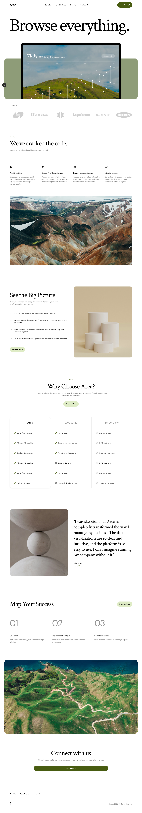
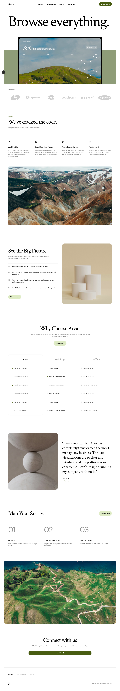
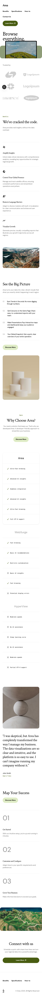

# End-to-end test evidence

## Reproduction

```bash
bun install
bunx playwright install chromium --with-deps
bun run e2e            # runs the suite (starts `bun run dev` itself)
bun run e2e:report      # opens the HTML report with traces/videos/screenshots
```

`bun run e2e` runs `playwright test` against `playwright.config.ts`, which
starts `bun run dev` on port 3100 via Playwright's `webServer`, so no manual
setup is required. Every test captures a screenshot, a video, and a trace
(`e2e-results/artifacts/`) plus an HTML report (`e2e-results/report/`) — none
of that is committed to the repo (see `.gitignore`); in CI it is uploaded as a
workflow artifact by `.github/workflows/e2e.yml`.

## Environment this run was performed in

| | |
|---|---|
| OS | macOS (Darwin 25.6.0, arm64) |
| Node | v24.16.0 (repo requires `>=20.9.0`, pinned to `22.12.0` in `.nvmrc`; CI uses the `.nvmrc` version) |
| Bun | 1.3.11 |
| Playwright | 1.62.1 (`@playwright/test`), Chromium only |
| Commit | `91fa9917a044757f8ddf75ad6faaf4f2d21b5814` |

## Results

```
Running 23 tests using 4 workers

  ✓ e2e/app.spec.ts › desktop light screenshot
  ✓ e2e/app.spec.ts › desktop dark screenshot
  ✓ e2e/app.spec.ts › mobile screenshot
  ✓ e2e/app.spec.ts › responds 200 and renders without console/page errors
  ✓ e2e/cli.spec.ts › malformed JSON exits 1 with a controlled message
  ✓ e2e/cli.spec.ts › missing manifest exits 1 with a controlled message
  ✓ e2e/cli.spec.ts › valid manifest exits 0 and prints the section count
  ✓ e2e/cli.spec.ts › invalid manifest (duplicate section names) exits 1 and names the offending path
  ✓ e2e/content-seam.spec.ts › renders the English value for ?locale=en
  ✓ e2e/content-seam.spec.ts › never renders a suffixed key in the HTML
  ✓ e2e/content-seam.spec.ts › falls back to English when the requested locale has no translation
  ✓ e2e/content-seam.spec.ts › 404s when E2E is not set on the server
  ✓ e2e/design-fidelity.spec.ts › Navigation matches the Figma design
  ✓ e2e/design-fidelity.spec.ts › Header matches the Figma design
  ✓ e2e/design-fidelity.spec.ts › LogoCloud matches the Figma design
  ✓ e2e/design-fidelity.spec.ts › Benefits matches the Figma design
  ✓ e2e/design-fidelity.spec.ts › FeaturesCarousel matches the Figma design
  ✓ e2e/design-fidelity.spec.ts › Specifications matches the Figma design
  ✓ e2e/design-fidelity.spec.ts › Testimonial matches the Figma design
  ✓ e2e/design-fidelity.spec.ts › HowItWorks matches the Figma design
  ✓ e2e/design-fidelity.spec.ts › ShowcaseImage matches the Figma design
  ✓ e2e/design-fidelity.spec.ts › CenteredCta matches the Figma design
  ✓ e2e/design-fidelity.spec.ts › Footer matches the Figma design

  23 passed (32.0s)
```

The eleven `design-fidelity` tests are the design gate: one per section in
`design/refs/refs.json`, each comparing the live render against the section's
Figma reference. See [`docs/decisions/0008`](../decisions/) for what it compares.

Existing suites stayed green throughout: `bun run validate:manifest` (18
sections, locale en), `bun run lint` (clean), `bun run test` (29/29 — the three
added tests scan every committed image for Figma interface, see below), `bun run
build` (static export succeeds, `out/index.html` has real content).

On GitHub Actions for this PR, the `CI` workflow's `verify` job
(validate:manifest, lint, test, build) and the separate `e2e` workflow both
passed against commit `5cc0385`, the commit before this one. The run for
`91fa991` is the authority for the transcript above; see the PR's checks.

## What this evidence does and does NOT prove

**Does prove:**
- The real, Figma-extracted homepage (11 sections, manifest-driven) boots,
  serves HTTP 200, and renders with no console or page errors, in both
  light/dark colour schemes and at desktop/mobile viewports.
- `lib/content.ts`'s seam (`getGlobal`) is exercised through a real HTTP
  request end to end: locale resolution and English fallback work against the
  actual fixture files, and — the assertion that matters for the Phase 2
  migration — no `_en`-suffixed key ever leaks into rendered HTML.
- The test-only `/e2e-seam` route is gated: it 404s on any server started
  without `E2E=1`, so it cannot ship reachable in a normal deploy. This was a
  real regression risk fixed in this PR — `next.config.ts`'s
  `output: 'export'` previously forced static-only rendering even under
  `next dev`, which broke this route's dynamic `searchParams` read (500s in
  CI); it's now scoped to production builds only.
- `scripts/validate-manifest.ts` handles all four real CLI paths (missing
  file, malformed JSON, valid manifest, invalid/duplicate sections) with
  controlled exit codes and messages, not stack traces.
- Every section's geometry and rough composition match the Figma design, and
  every committed image is design rather than a screenshot of Figma's own
  interface. Both of these had already failed in this branch and shipped: three
  captures returned the wrong region of canvas, one of them carrying Figma's
  dimension badge into `public/`.

**Does NOT prove:**
- That every section *pixel*-matches the Figma design. The gate compares aspect
  ratio against the design size and coarse block colour against the reference
  image; it is not a pixel diff, and it cannot see fine typographic or hairline
  differences. On a section that is mostly background a low block score is weak
  evidence — `design/refs/refs.json` says so where it applies.
- Anything about Payload/Phase 2, since that phase doesn't exist yet.
- Cross-browser behaviour: only Chromium is installed and tested.
- That the live Vercel deployment renders correctly — deployment (Task 6
  Step 4) is a manual step pending human action; see `README.md`.

## Screenshots

| | |
|---|---|
|  Desktop, light scheme — real Figma-extracted content |  Desktop, dark scheme — real Figma-extracted content |
|  Mobile, 375×812 — real Figma-extracted content |  `/e2e-seam` — real content resolved through `lib/content.ts` |
